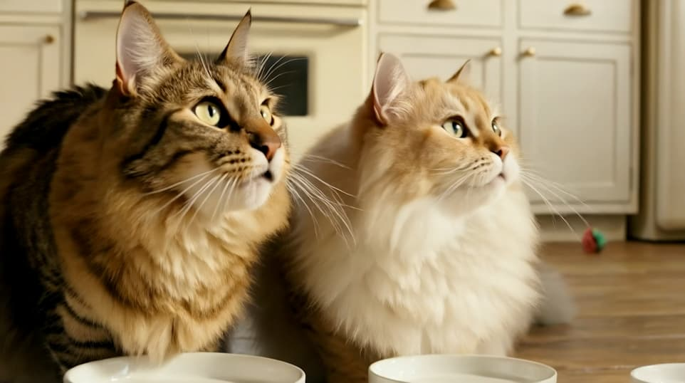
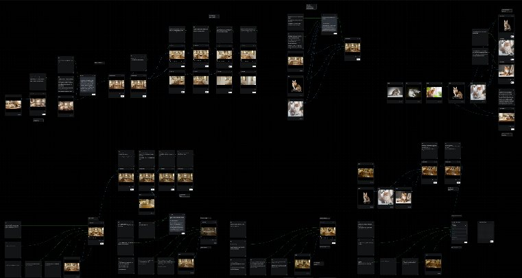
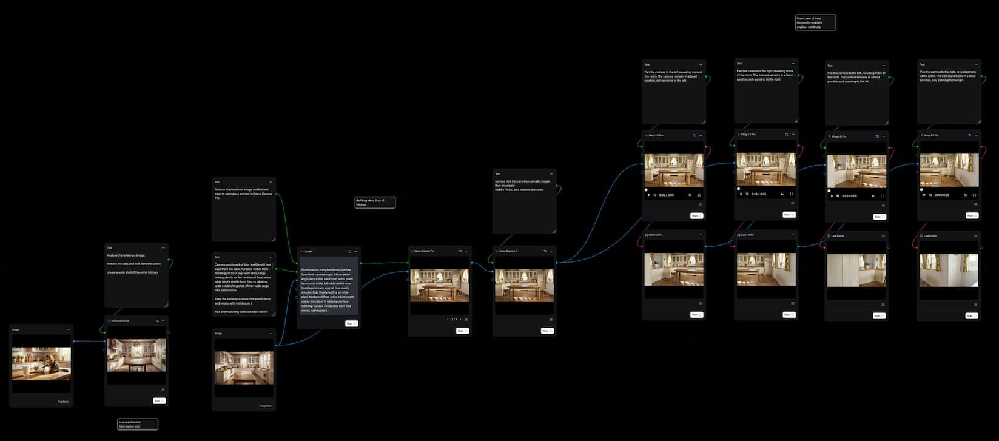
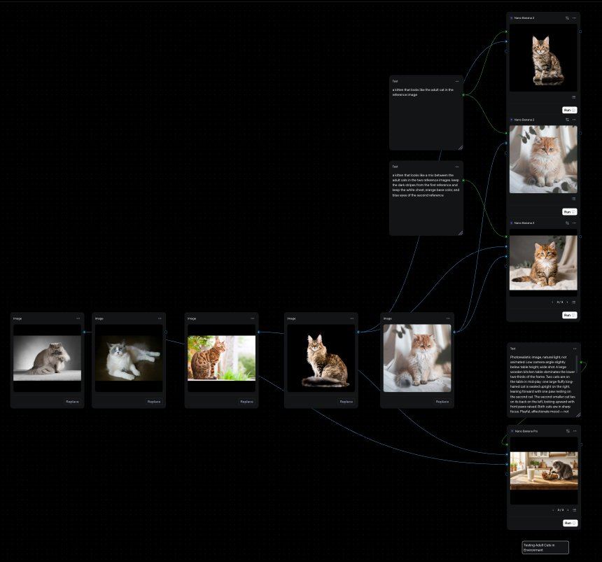
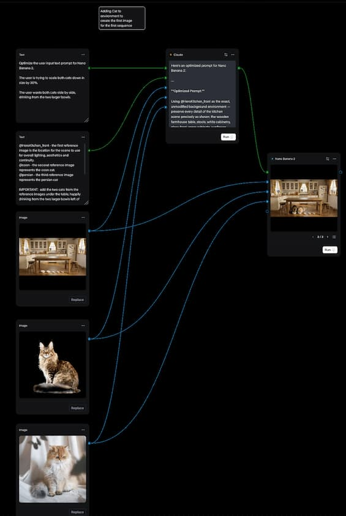
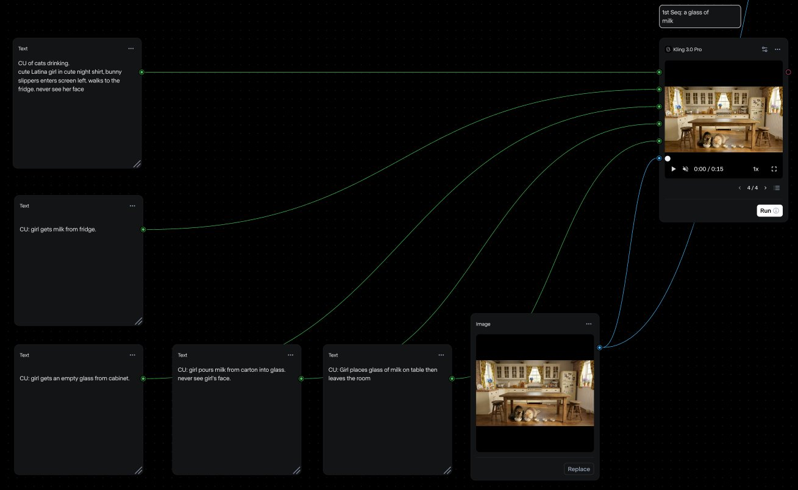
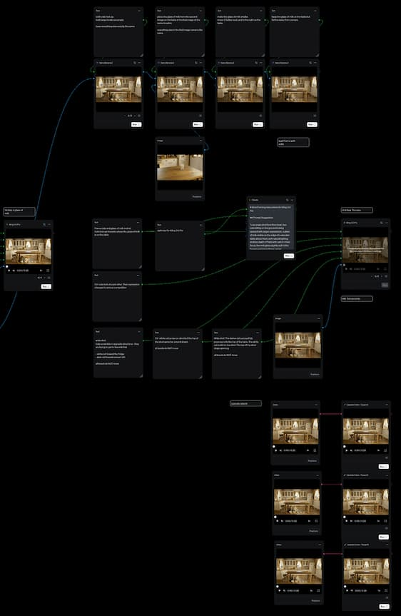
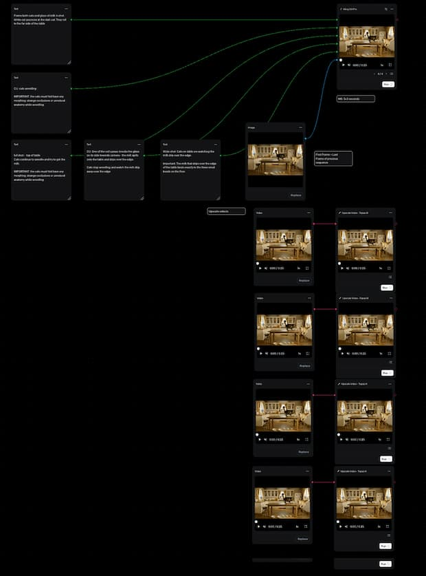
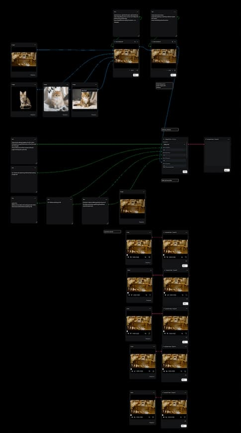

# multimodal-video-workflow-spilt-milk
AI-generated short film exploring narrative, continuity, and editing through a structured generative workflow.

# Spilt Milk — AI Short Film Workflow

[](https://www.youtube.com/watch?v=BKqU0lPYF0Q)

## Overview

*Spilt Milk* is a short narrative film created using a structured, multi-stage generative AI workflow. The project explores how AI tools can be orchestrated into a cohesive production pipeline to achieve continuity, narrative clarity, and visual consistency across multiple shots.

The focus of this work is not individual outputs, but the design of a system that enables reliable filmmaking using generative tools.

---

## Project Goals

* Maintain a consistent environment across shots
* Preserve character identity throughout sequences
* Achieve temporal continuity in AI-generated video
* Construct a clear narrative arc using generative systems

---

## Final Output

* 🎬 **Film:** [https://www.youtube.com/watch?v=BKqU0lPYF0Q](https://www.youtube.com/watch?v=BKqU0lPYF0Q)
* 🎧 **Music (Suno):** [`/audio/Spilt Milk Love.mp3`](audio/SpiltMilkLove.mp3)

> Tip: If the filename changes, update the link above to match the file in `/audio/`.

---

## Workflow Summary

The pipeline is organized into four primary stages:

1. Environment creation and continuity setup
2. Character development and selection
3. Sequence-based video generation
4. Editorial assembly and finishing

  [](https://app.runwayml.com/video-tools/teams/trapezy/ai-tools/workflows/c8999c3f-55c1-49a3-8d44-129cf54d7a05/edit)

<p align="center">
<strong>Full Interactive Workflow:</strong><br>
Click to view in Runway
</a>
</p>

---

## Environment Development



A base kitchen environment was generated and treated as a persistent world space. Multiple variations and camera angles were derived from this foundation while preserving lighting, layout, and overall composition.

This step establishes spatial continuity and provides a stable backdrop for all subsequent sequences.

---

## Character System



A selection process was used to identify “hero” adult cats from a larger set of generated candidates. These selections were then used as the basis for generating kitten variations, ensuring visual consistency and believable relationships between characters.

This approach avoids randomness and instead creates a controlled character pipeline.

---

## Scene Initialization



The initial scene establishes the baseline composition, spatial relationships, and staging for the film. Characters are placed within the environment and serve as the anchor point for all downstream sequences.

---

## Sequence Construction

The narrative is built across four sequences, each consisting of five short shots generated using multi-shot video workflows.

### Sequence 01 — Establishment



Introduces the environment and primary characters. Establishes tone, pacing, and baseline behavior.

---

### Sequence 02 — Trigger Event



Introduces a new object (glass of milk) which redirects character attention and initiates narrative movement.

---

### Sequence 03 — Escalation



Increasing interaction complexity and motion within the scene as the cats wrestle and knock over the glass of milk.

---

### Sequence 04 — Climax



Introducing the new kitten characters to drink the spilt milk, serving as the narrative payoff while maintaining continuity across motion-heavy shots.

---

## Continuity Strategy

Maintaining continuity across generated shots was a central challenge. Two primary techniques were used:

* **Frame Handoff** — The final frame of one sequence was used as a reference for the next to maintain visual alignment
* **Narrative Anchors** — New elements (objects or characters) were introduced deliberately to guide transitions

These strategies allowed the system to preserve coherence across independently generated outputs.

---

## Narrative and Editorial Approach

Although generated with AI, the project follows a traditional storytelling structure:

* Setup — stable environment and characters
* Escalation — introduction of new elements
* Climax — physical interaction and outcome
* Resolution — aftermath and continuity

Each shot was designed with a specific role in the sequence, and the final edit focused on pacing, rhythm, and clean transitions.

---

## Tools and Technologies

* Runway — environment and image generation
* Kling — multi-shot video generation and continuity
* Suno — music generation (see `/audio/` for the track used)
* Adobe Premiere Pro — editing and final assembly

---

## Challenges

* Maintaining character consistency across sequences
* Preventing visual drift in environment details
* Controlling motion artifacts in generated video
* Preserving continuity across independently generated shots

---

## Key Takeaways

* AI video generation requires structured workflows to achieve reliable results
* Continuity must be designed into the system, not expected from the model
* Narrative clarity emerges from sequencing and editorial decisions, not generation alone

---

## Repository Structure

```
/images      # workflow diagrams and references
/audio       # AI-generated music (Suno)
```

<p align="center">
<strong>Full Interactive Workflow:</strong><br>
<a href="https://app.runwayml.com/video-tools/teams/trapezy/ai-tools/workflows/c8999c3f-55c1-49a3-8d44-129cf54d7a05/edit">
Click to view in Runway
</a>
</p>

```

---

## Notes

This project is intended as a case study in applying AI tools to a production-oriented workflow, demonstrating how generative systems can be used to construct coherent, multi-shot narratives.

```
